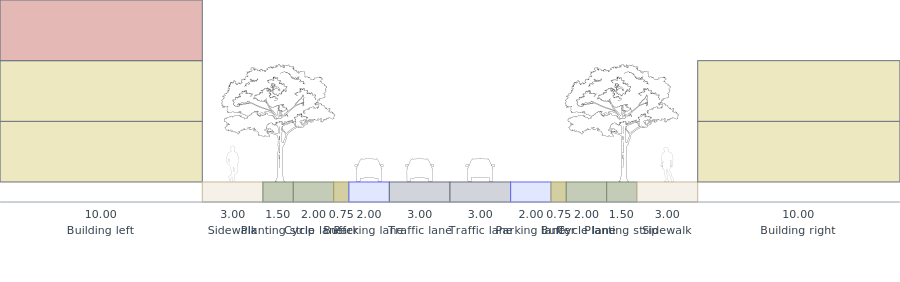

# street-generator-mcp

An [MCP](https://modelcontextprotocol.io) server that lets Claude design and render
**urban street cross-sections** from natural language, in the visual style of the
[Street Generator](https://streetgenerator.com) app, figures and all. It can also read a
**real street from an address** via OpenStreetMap.



## The idea

> Claude does the open-ended reasoning (designing the street). The server does the
> deterministic work (drawing it).

The server holds no LLM, no API keys, and no secrets. It keeps the model's output small (a
compact `StreetConfig` instead of thousands of tokens of hand-drawn SVG) and moves the heavy,
exact rendering into code. The result is faster, cheaper, and reliable: every street is drawn
by the same renderer, identical every time.

```
User: "a calm residential street, wide sidewalks, trees, protected bike lanes"
   |
   v
Claude -> StreetConfig (JSON), guided by the tool schema
   |
   |-- render_street(config, style)   -> server draws an illustrated SVG
   |-- build_share_url(config)        -> streetgenerator.com/?s=...
   |
   v
Claude shows the image and the link
```

## Tools

### `render_street(config, style?)`
Renders a `StreetConfig` to an illustrated SVG cross-section (buildings as floor stacks,
sidewalks with pedestrians, planting strips with trees, lanes with cars).

`style` (optional): `colorMode` `"outline"` (default) or `"color"`, plus `showLabels`,
`showMeasurements`, `showFigures` (all default `true`).

### `import_street_from_osm(street, houseNumber, city, postcode, country, style?)`
Reads a real street from OpenStreetMap and renders it. Give a full address (street, house
number, city, postcode, country). If any part is missing or unclear, Claude asks first. When
several places match, the tool returns lettered candidates (A, B, C) so you can pick one, then
it renders the chosen street.

Under the hood: geocode the address (Nominatim), read the nearest street's tags (Overpass),
interpret and map them to a `StreetConfig`, then render. This tool needs internet access; the
other two do not.

### `build_share_url(config)`
Returns a `streetgenerator.com` link that opens the design in the live app, where you can keep
editing and export it.

## What you get back

Every render returns the **cross-section as SVG** (which you can save) together with a
**streetgenerator.com link** that opens the same design in the app, where the app's own PNG,
SVG, and JSON exports are available. Native PNG output from the server is on the roadmap (see
Future work).

## Examples

From simple to more complex. You type these to Claude; it calls the tools and shows the result.

| Prompt | What you get |
|---|---|
| "Render a two-lane street with sidewalks on both sides." | A simple SVG cross-section (two traffic lanes, two sidewalks) and a share link. |
| "Design a calm residential street with wide sidewalks, street trees, and a protected bike lane on each side." | A fuller illustrated SVG with pedestrians, trees, and buffered cycle lanes, plus a share link. |
| "Draw a boulevard with a central median, bus lanes, and buildings, in colour." | A wide coloured cross-section with a median, bus lanes, and building floor stacks. |
| "Design a one-way street with parking, and hide the width numbers." | An SVG with labels but no measurements (a style option), plus a share link. |
| "Show me the street at Unter den Linden 77, 10117 Berlin, Germany." | The real street read from OpenStreetMap and rendered, plus a share link. |
| "Load the street at Hauptstrasse 1, Germany." (ambiguous address) | A lettered list of candidate places (A, B, C) to choose from; pick one and it renders. |

## Usage and external services

`import_street_from_osm` queries two free OpenStreetMap services: **Nominatim** (geocoding) and
**Overpass** (map data). It is meant for occasional, interactive lookups, not bulk downloading.
Please stay within their public usage policies:

- **Nominatim:** at most 1 request per second, an identifying `User-Agent` (already set by this
  server), results cached where possible, and no automated or bulk querying. See the
  [Nominatim usage policy](https://operations.osmfoundation.org/policies/nominatim/).
- **Overpass:** fair use only, roughly up to 10,000 requests and 1 GB of data per day per IP,
  with rate limiting under load and a 180 second per-request timeout. See the
  [Overpass usage guidance](https://dev.overpass-api.de/overpass-doc/en/preface/commons.html).

For heavy or automated use, run your own Nominatim or Overpass instance instead of the public
servers. Map data is copyright OpenStreetMap contributors, available under the ODbL; displayed
results should attribute OpenStreetMap accordingly.

## Install (Claude Desktop)

```json
{
  "mcpServers": {
    "street-generator": {
      "command": "node",
      "args": ["/absolute/path/to/street-generator-mcp/dist/index.js"]
    }
  }
}
```

Then ask Claude to design or import a street and it calls the tools automatically.

## Develop

```bash
npm install
npm test          # unit, mocked-network, and fidelity tests
npm run build     # compile to dist/ and copy figure assets
npm run dev       # run the server from source
```

## How the rendering stays faithful to the app

The layout math, element data, figure art, and the OSM interpreter/mapper are ported
value-for-value from the Street Generator app (the interpreter and mapper come with their
original unit tests). Fidelity is checked with structural tests in `test/`.

## Future work
- PNG output from the server (SVG to raster).
- `validate_street` against Berlin RASt rules (the engine already exists in the app).
- Nearest-way selection for OSM import (v1 takes the first street within a radius of the
  geocoded point).
- Figures for cycle and bus lanes once art exists.
